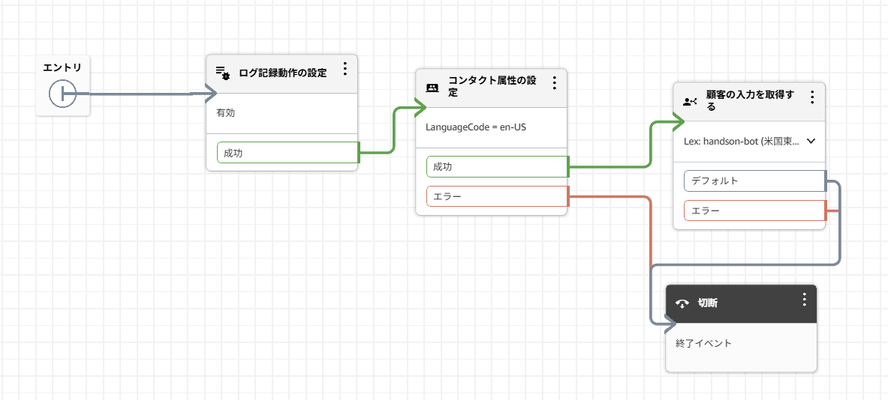

# Bedrock + Amazon Lex + Amazon Connect ナレッジベースチャットボット構築手順

AWSサービスを活用したナレッジベースチャットボットの構築についての説明です。

## 目次

- [構成図](#構成図)
- [前提条件](#前提条件)
- [構築手順](#構築手順)
  - [1. Amazon Bedrockの設定](#1-amazon-bedrockの設定)
  - [2. Amazon Lexの設定](#2-amazon-lexの設定)
  - [3. Amazon Connectの設定](#3-amazon-connectの設定)
- [トラブルシューティング](#トラブルシューティング)

## 構成図

## 前提条件

- AWSアカウント
- Amazon Bedrockの埋め込みモデルへのアクセス権限（事前にリクエスト必要）
- チャットボットを設置するWebサイトのドメイン

## 構築手順

### 1. Amazon Bedrockの設定

#### 1.1 ナレッジベースの作成

1. AWSコンソールでBedrockを開く
2. 「ナレッジベース」→「ナレッジベースを作成」を選択
3. 以下の設定を行う：
   - **IAM**: 「新しいサービスロールを作成して使用」を選択
   - **データソース**: S3を選択し、AIが参照するデータを格納
   - **埋め込みモデル**: 利用可能なモデルを選択

#### 1.2 データの同期とテスト

4. ナレッジベース作成後、「データソース」から**「同期」を実行**（必須）
5. 同期完了後、「ナレッジベースをテスト」で動作確認

---

### 2. Amazon Lexの設定

#### 2.1 ボットの作成

1. Amazon Lexコンソールで「ボットを作成」を選択
2. 「空のボットを作成します」を選択
3. 以下の設定を行う：
   - **ボット名**: 任意の名前を入力
   - **言語**: **英語(US)を選択**（⚠️ QnAIntent機能は英語(US)のみ対応）
   - **IAM permissions**: 「Create～」をクリック
   - **Children's ~**: 「No」を選択

#### 2.2 本番エイリアスの設定

4. Bot作成後、Intent画面で「< Back to ～」をクリック
5. ** 本番エイリアス（例: PROD）を作成**（重要）

#### 2.3 Intentの作成

6. 「Add Intent」→「Use built-in intent」を選択
7. 以下を設定：
   - **Knowledge store**: Amazon Bedrockを選択
   - **Bedrock ID**: 作成したナレッジベースのIDを入力
   - **サンプルチャット**: 任意のテスト文を入力
8. 保存、構築、テストを実行

---

### 3. Amazon Connectの設定

#### 3.1 インスタンスの作成

1. Amazon Connectコンソールで「インスタンスを追加する」を選択
2. アクセスURLを入力して作成

#### 3.2 Amazon Lexとの連携

3. 「問い合わせフロー」→「Amazon Lex」から作成したボットを選択して紐づけ

#### 3.3 コンタクトフローの作成

4. 新しいコンタクトフローを作成し、以下のブロックを配置：
   - **コンタクト属性の設定**: 言語を **en-US** に設定
   - **顧客の入力を取得する**: 
     - Amazon Lexから作成したボットを選択
     - 「テキスト読み上げまたはチャットテキスト」でプロンプトメッセージを入力
5. **保存して公開**

#### 3.4 コミュニケーションウィジェットの設定

6. 「コミュニケーションウィジェット」→「ウィジェットの追加」を選択
7. 以下を設定：
   - **チャットのコンタクトフロー**: 作成したフローを選択
   - **ウェブ通話**: チェックを外す
   - **ドメイン**: チャットボットを設置するWebサイトのドメインを入力
   - **JWT**: 「いいえ」を選択
8. 生成された「ウィジェットのスクリプト」をコピーし、WebサイトのHTMLに貼り付け

---

## トラブルシューティング

### ⚠️ 問題1: エイリアス設定のエラー

**エラーメッセージ:**
TestBotAliasは本番環境のトラフィックに使用してはなりません

**原因:**  
テスト用エイリアス（TestBotAlias）を本番環境で使用しようとした

**解決策:**
- Lexコンソールで本番用エイリアス（PROD等）を作成
- Amazon Connectの設定で本番用エイリアスを選択

---

### ⚠️ 問題2: パラメータデータがないエラー

**エラーメッセージ:**
1つ以上の入力パラメータがないか、無効になっています

**原因:**  
「顧客の入力を取得する」ブロックでプロンプトが未設定

**解決策:**
1. 「テキスト読み上げまたはチャットテキスト」を選択
2. 適切なメッセージテキストを入力
3. ブロックを保存してフローを公開

---

### ⚠️ 問題3: 403/401エラー（最重要）

**現象:**  
チャットウィジェットが表示されず、コンソールに403/401エラーが大量発生

**原因:**
1. Amazon Connect側でCloudFrontドメイン（`https://dxxxxxx.cloudfront.net`）が未登録
2. CSP（Content Security Policy）が厳しすぎて接続をブロック

**解決策:**

#### ステップ1: ドメインの登録
Amazon Connectのコミュニケーションウィジェット設定で「ドメインとセキュリティ」にCloudFrontのURLを追加

#### ステップ2: CSPの調整
1. CSPを一旦削除して動作確認
2. 動作確認後、以下を含む適切なCSPを再設定：
   - `'unsafe-eval'`
   - `worker-src`
   - `blob:`

---

## 📝 補足

- Amazon Lexは英語(US)での設定が必須
- 本番環境では必ず本番用エイリアスを使用
- データソースの同期は必ず実行すること
- コンタクトフローは保存後に公開が必要

## 🔗 参考リンク

- [Amazon Bedrock Documentation](https://docs.aws.amazon.com/bedrock/)
- [Amazon Lex Documentation](https://docs.aws.amazon.com/lex/)
- [Amazon Connect Documentation](https://docs.aws.amazon.com/connect/)